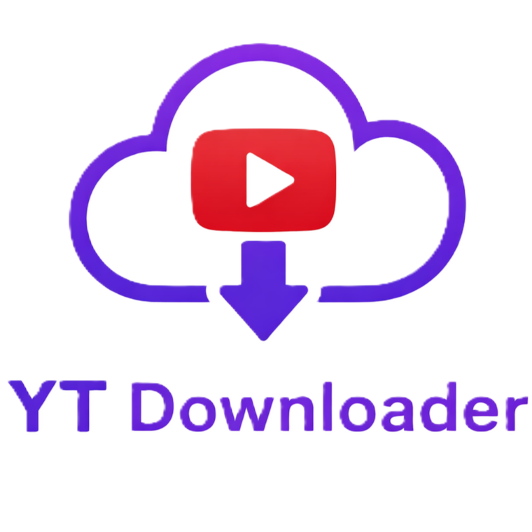

# YT Downloader



YT Downloader es una aplicación de escritorio para Windows que permite descargar videos y audio de YouTube de forma sencilla. Soporta descargas individuales y playlists completas, con control de calidad, cola de descargas simultáneas e historial persistente.

---

## Requerimientos previos

Antes de ejecutar el proyecto asegúrate de tener instalado lo siguiente:

- **Python 3.11 o superior** — [python.org](https://www.python.org/downloads/)
- **Node.js** — requerido por yt-dlp para resolver ciertos desafíos de YouTube. [nodejs.org](https://nodejs.org/)
- **ffmpeg** — necesario para la conversión de audio a MP3 y el merge de streams de video. Debe colocarse en la carpeta `ffmpeg/bin/` en la raíz del proyecto. [gyan.dev/ffmpeg](https://www.gyan.dev/ffmpeg/builds/)

---

## Instalacion

1. Clona el repositorio:

```bash
git clone https://github.com/JoseRefugio2305/YT_Downloader.git
cd yt-downloader
```

2. Crea y activa un entorno virtual:

```bash
python -m venv myvenv
myvenv\Scripts\activate
```

3. Instala las dependencias:

```bash
pip install -r requirements.txt
```

4. Coloca ffmpeg en la carpeta correcta:

```
yt-downloader/
└── ffmpeg/
    └── bin/
        ├── ffmpeg.exe
        ├── ffplay.exe
        └── ffprobe.exe
```

5. Ejecuta la aplicación:

```bash
python main.py
```

---

## Tecnologias utilizadas

**Lenguaje**

- Python 3.11+

**Interfaz grafica**

- PySide6 — framework de Qt para Python, usado para construir toda la interfaz de escritorio

**Descarga de contenido**

- [yt-dlp](https://github.com/yt-dlp/yt-dlp) — biblioteca de descarga de videos, fork activo de youtube-dl con soporte extendido de formatos y plataformas

**Procesamiento de audio y video**

- ffmpeg — usado para la extraccion de audio, conversion a MP3, merge de streams de video y audio, y embedding de metadatos y caratula en archivos MP3

**Base de datos**

- SQLite3 — base de datos local para persistir el historial de descargas y playlists

**Configuracion**

- QSettings (PySide6) — almacenamiento persistente de preferencias del usuario

---

## Estructura del proyecto

```
yt-downloader/
├── main.py
├── requirements.txt
├── ffmpeg/
│   └── bin/
├── assets/
└── app/
    ├── core/
    │   ├── downloader.py
    │   ├── playlist_manager.py
    │   ├── settings/
    │   └── workers/
    ├── database/
    │   ├── db_manager.py
    │   └── models.py
    ├── ui/
    │   ├── main_window.py
    │   └── resources/
    └── utils/
```

---

## Funcionalidades

- Descarga de videos en formato MP4 con seleccion de calidad (Mejor calidad, 1080p, 720p, 480p, 360p)
- Descarga de audio en formato MP3 con caratula y metadatos embebidos
- Soporte para playlists completas de YouTube
- Cola de descargas con limite de descargas simultaneas configurable
- Historial persistente de descargas con opciones de reintento y eliminacion
- Configuracion de carpeta de destino, limite de velocidad y delay entre descargas
- Seleccion de cliente de YouTube (tv_embedded, web, android) para compatibilidad con distintos tipos de videos

---

>[!NOTE]
> Este proyecto es de uso personal y educativo. El uso de esta herramienta debe respetar los terminos de servicio de YouTube y las leyes de derechos de autor aplicables en tu pais.


